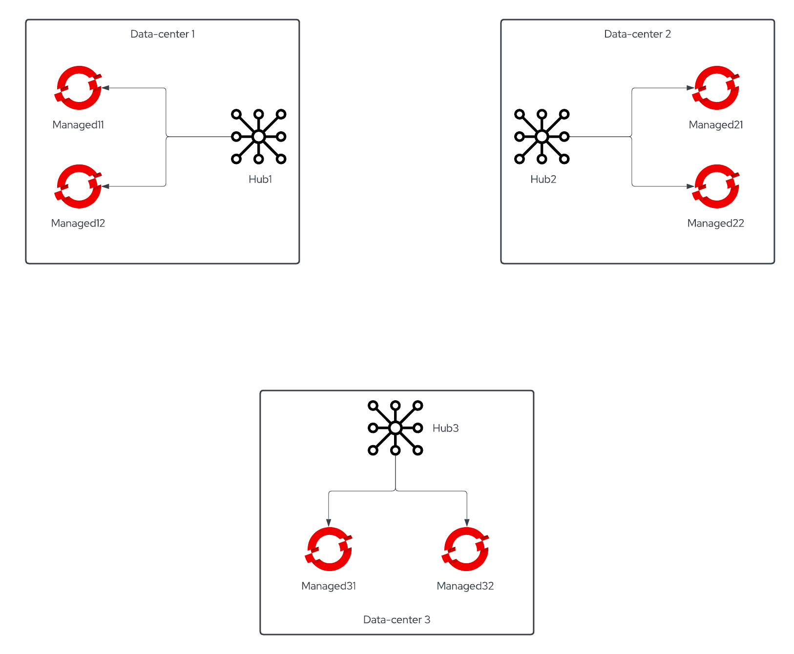
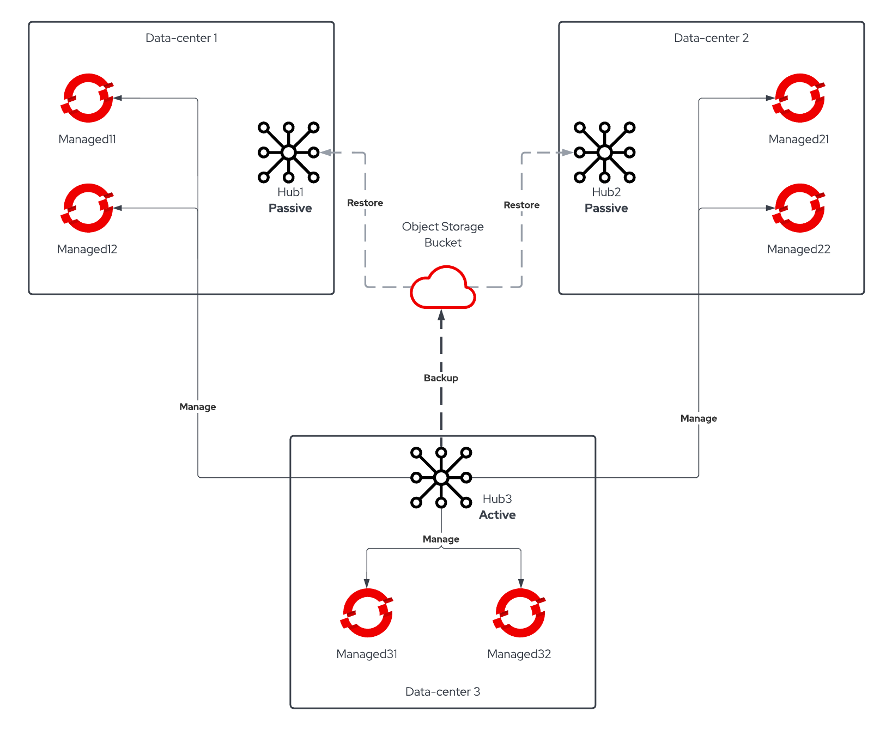

# How to move from standalone RHACM to Active/Passive Setup

Recently one of our Customers asked how to move from a standalone RHACM setup to an Active/Passive Hub one given that the [Hub Backup and Restore feature went GA on Red Hat Advanced Cluster Management 2.5](https://www.redhat.com/en/blog/red-hat-brings-greater-simplicity-and-flexibility-kubernetes-management-latest-version-red-hat-advanced-cluster-management-kubernetes).

## Customer scenario

The Customer had a **3 data-centers setup**, each one with its own RHACM Cluster Hub responsible of managing the local OCP clusters. They planned their setup with disaster recovery in mind so there were no object name collisions. The initial DR plan was to manually import OpenShift clusters of the failed Cluster Hub into one of the other two.



All the policies were synchronized on all the Cluster Hubs via GitOps, while this approach permitted a sort of hot standby capability - importing clusters would've been enough to start applying policies on them - it caused a **lot of policies with unknown state** since the clusters where they were supposed to be applied weren't present.

Another problem was the **loss of cluster creation data in case of Cluster Hub failure**: our Customer leveraged RHACM to create OpenShift clusters on VMware infrastructure running on their 3 data-centers, this data would not be automatically imported into another Cluster Hub.

Given all of that, Customer was really keen to adopt the new Business Continuity model offered by RHACM 2.5 Backup and Restore feature. We'll not discuss the setup of the feature here - you can find a great explanation [here](https://cloud.redhat.com/blog/backup-and-restore-hub-clusters-with-red-hat-advanced-cluster-management-for-kubernetes) - we'll focus instead on the procedure adopted to move from 3 standalone RHACM Cluster Hubs to one Active Cluster Hub and two Passive Cluster Hubs.



## Moving Standalone Cluster Hubs to Active/Passive Procedure

RHACM Backup and Restore feature was leveraged by [Red Hat Consulting](https://www.redhat.com/en/services/consulting) to move the managed clusters from the *soon-to-be* Passive Hubs into the designated Primary Hub by following this procedure:

1. Hub Backup was configured on all the RHACM cluster hubs, each Hub initially pointed to a dedicated prefix on the object storage bucket to have a valid backup for each of the hubs separately.

   Hub1 example `DataProtectionApplication`:

   ```yaml
   apiVersion: oadp.openshift.io/v1alpha1
   kind: DataProtectionApplication
   metadata:
     name: dpa-hub1
   spec:
     configuration:
       velero:
         defaultPlugins:
         - openshift
         - aws
       restic:
         enable: false
     backupLocations:
       - name: default
         velero:
           provider: aws
           default: true
           objectStorage:
             bucket: my-bucket
             prefix: hub1 # <<<< Set a dedicated prefix for each of the hubs
           config:
             region: us-east-1
             profile: "default"
           credential:
             name: cloud-credentials
             key: cloud
     snapshotLocations:
       - name: default
         velero:
           provider: aws
           config:
             region: us-west-2
             profile: "default"
   ```

2. Once all the Hub backups are completed, delete the `BackupSchedule` CR to stop the Hub backups.
3. Delete the `DataProtectionApplication` from the **Primary Hub** and recreate it *using the prefix of the first Cluster Hub you wish to make Passive*.

   Hub1 example `DataProtectionApplication` *pointing to Hub2 prefix*:

   ```yaml
   apiVersion: oadp.openshift.io/v1alpha1
   kind: DataProtectionApplication
   metadata:
     name: dpa-hub1
   spec:
     configuration:
       velero:
         defaultPlugins:
         - openshift
         - aws
       restic:
         enable: false
     backupLocations:
       - name: default
         velero:
           provider: aws
           default: true
           objectStorage:
             bucket: my-bucket
             prefix: hub2 # <<<< points to hub2 backup location
           config:
             region: us-east-1
             profile: "default"
           credential:
             name: cloud-credentials
             key: cloud
     snapshotLocations:
       - name: default
         velero:
           provider: aws
           config:
             region: us-west-2
             profile: "default"
   ```

4. Verify that the velero pod is running and check if the `BackupStorageLocation` is available:

   ```bash
   oc -n open-cluster-management-backup get backupstoragelocation
   NAME        PHASE       LAST VALIDATED   AGE   DEFAULT
   dpa-hub1-1   Available   58s              2d    true
   ```

   You can also verify in the velero pod logs that the backups are discovered and imported.

5. Detach all the managed clusters from the Cluster Hub that you are making Passive, ***wait for the process to complete***.
6. On the Primary Hub, create a one-shot `Restore` Custom Resource to import the managed clusters previously attached to the hub you are making Passive:

   ```yaml
   apiVersion: cluster.open-cluster-management.io/v1beta1
   kind: Restore
   metadata:
     name: import-hub2-clusters
     namespace: open-cluster-management-backup
   spec:
     cleanupBeforeRestore: None # IMPORTANT: prevent the restore to delete anything from the Primary Hub during the restore
     veleroManagedClustersBackupName: latest
     veleroCredentialsBackupName: latest
     veleroResourcesBackupName: latest
   ```

   ***ATTENTION***: it is really important to set the `cleanupBeforeRestore` value to `None` to prevent accidental deletion of restored objects from the Primary Hub.

   When the `Restore` terminates you should see the managed clusters added to you Primary Hub.
7. Repeat the steps **from 3 to 6** to move other Cluster Hubs to a Passive role.
8. When you are done moving the managed clusters from the Passive Hubs to the Primary Hub, you can complete the configuration of the Active/Passive feature.

   Set a prefix on your `DataProtectionApplication` Custom Resource that will be used for both Active and Passive Hubs:

   ```yaml
   apiVersion: oadp.openshift.io/v1alpha1
   kind: DataProtectionApplication
   metadata:
     name: dpa-hub1
   spec:
     configuration:
       velero:
         defaultPlugins:
         - openshift
         - aws
       restic:
         enable: false
     backupLocations:
       - name: default
         velero:
           provider: aws
           default: true
           objectStorage:
             bucket: my-bucket
             prefix: active-passive # <<<< final location of the backups, passive hubs will restore from here
           config:
             region: us-east-1
             profile: "default"
           credential:
             name: cloud-credentials
             key: cloud
     snapshotLocations:
       - name: default
         velero:
           provider: aws
           config:
             region: us-west-2
             profile: "default"
   ```

   Create the same `DataProtectionApplication` Custom Resource on all the Cluster Hubs.
9. On the Primary Hub create the `BackupSchedule` Custom Resource to start taking backups to the new location.
10. On the Passive Hubs create a *one-shot* `Restore` with the `cleanupBeforeRestore` set to `CleanupAll` to prepare the former standalone Hub to receive restores from the Primary Hub without any left-over:

      ```yaml
      apiVersion: cluster.open-cluster-management.io/v1beta1
      kind: Restore
      metadata:
        name: restore-with-cleanupall
        namespace: open-cluster-management-backup
      spec:
        cleanupBeforeRestore: CleanupAll # This will cleanup ALL the resources from the Passive hub
        veleroManagedClustersBackupName: skip
        veleroCredentialsBackupName: latest
        veleroResourcesBackupName: latest
      ```

      Only the resources that would be backed up will be deleted by this `Restore`, **the task will honor backup exclusion label**.

11. On the Passive Hubs create the `Restore` Custom Resource to periodically restore passive data from the Primary Hub: [cluster_v1beta1_restore_passive_sync.yaml](https://github.com/stolostron/cluster-backup-operator/blob/release-2.5/config/samples/cluster_v1beta1_restore_passive_sync.yaml)

## Common pitfalls

- Pay attention to the name of the objects, if you find name collisions deal with them prior to switch to Active/Passive.

- Policies applied to the Cluster Hub itself are backed up automatically, if those are different across your Cluster Hubs, exclude them using the label

  ```yaml
  velero.io/exclude-from-backup: "true"
  ```

## Conclusions

Applying the procedure described earlier allowed the Customer to move to the new Business Continuity feature offered by Red Hat Advanced Cluster Management 2.5.
